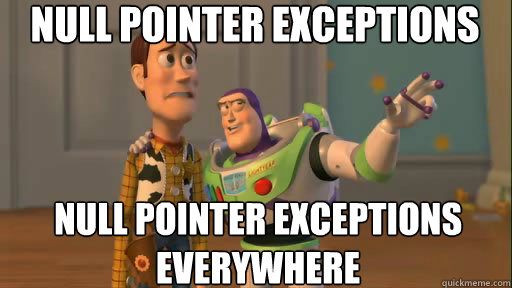

# SafeStuff

[](https://cocoapods.org/pods/SafeStuff)
[](https://cocoapods.org/pods/SafeStuff)

A super set of safe extensions to avoid the most common crashes in iOS apps.



## Example

To run the example project, clone the repo, and run `pod install` from the Example directory first.

## Safe Extensions

The following UIKit elements are implementing this protocol that contains a safe text.

```swift
protocol SafeTextProtocol {
    var safeText: String { get }
}
```

<ul>
<li>UITextField</li>
<li>UILabel</li>
<li>UIButton</li>
</ul>

The following UIKit elements are implementing this protocol that contains a safe title.

```swift
protocol SafeTitleProtocol {
    var safeTitle: String { get }
}
```

<ul>
<li>UIBarButtonItem</li>
<li>UINavigationBar</li>
<li>UINavigationItem</li>
<li>UIViewController</li>
</ul>


## Installation

SafeStuff is available through [CocoaPods](https://cocoapods.org). To install
it, simply add the following line to your Podfile:

```ruby
pod 'SafeStuff'
```

## Author

My name is Carlos Mejía, I am passionate about software development, I have experience working with Android (in Java and Kotlin), Frontend (with ReactJS and Angular 1.2), with backend (.net core and NodeJS) and I focus mainly with iOS.

Thanks for reading up here! :)

luiscarlos083@hotmail.com
https://www.instagram.com/carlosmejia083/

## License

SafeStuff is available under the MIT license. See the LICENSE file for more info.
